# Calculus \- Integrals

 or 

**Módulo Curricular**

_Creado con R2021b. Compatible con R2021b y versiones posteriores._

# Información

Las soluciones están disponibles a petición del instructor. Contacta al equipo de recursos didácticos de MathWorks si deseas solicitar soluciones, proporcionar comentarios o si tienes alguna pregunta.

Este módulo curricular contiene [live scripts de MATLAB®](https://www.mathworks.com/products/matlab/live-editor.html) interactivos que enseñan conceptos fundamentales y terminología básica relacionada con el cálculo integral. Se enfoca en la aproximación numérica y la representación gráfica como herramientas para entender los conceptos del cálculo integral.

## Antecedentes

Puedes utilizar estos live scripts como [demostraciones](#H_9AAE657C) en conferencias, actividades en clase o asignaciones interactivas fuera de clase. Cálculo - Integrales cubre aproximaciones de sumas de Riemann a integrales definidas, integrales indefinidas como antiderivadas, y el teorema fundamental del cálculo. También abarca las integrales indefinidas de potencias, exponenciales, logaritmos naturales, senos y cosenos, así como sustitución e integración por partes. Las aplicaciones incluyen área y potencia. Además de los scripts completos, visualizaciones y scripts de práctica, también se incluye una [aplicación de Tarjetas Educativas de Cálculo](#H_1F9459BC).

Las instrucciones dentro de los live scripts te guiarán a través de los ejercicios y actividades. Comienza con cada live script ejecutándolo una sección a la vez. Para detener la ejecución del script o una sección a mitad de camino (por ejemplo, cuando una animación está en progreso), utiliza el botón de Detener  en la sección **EJECUTAR** de la pestaña **Live Editor** en la Barra de Herramientas de MATLAB.

¿Buscas más? ¿Encontraste un problema? ¿Tienes una sugerencia? Por favor, contacta al [equipo de enseñanza en línea de MathWorks](mailto:%20onlineteaching@mathworks.com).

## Contáctanos
Las soluciones están disponibles a petición del instructor. Contacta al [equipo de recursos didácticos de MathWorks](mailto:onlineteaching@mathworks.com) si deseas solicitar soluciones, proporcionar retroalimentación o si tienes alguna pregunta.

## Prerrequisitos

Este módulo asume un conocimiento de funciones que es estándar en los materiales del curso de precálculo con respecto a potencias, exponenciales, valores absolutos, logaritmos, senos, cosenos, funciones racionales y asíntotas. También asume conocimiento de fórmulas básicas de área, incluyendo el área de un trapecio. Con la excepción de <samp>Riemann.mlx</samp> y <samp>RiemannViz.mlx</samp>, los scripts están escritos para seguir a [Cálculo-Derivadas](https://github.com/MathWorks-Teaching-Resources/Calculus-Derivatives) y esperan un entendimiento básico de derivadas y reglas de derivación. Hay poca expectativa de familiaridad con MATLAB, pero podrías usar [MATLAB Onramp](https://matlabacademy.mathworks.com/details/matlab-onramp/gettingstarted) como otro recurso para adquirir familiaridad con MATLAB.

## Comenzando
### Accediendo al Módulo
### **En MATLAB Online:**

Utiliza el enlace  para descargar el módulo. Se te pedirá que inicies sesión o crees una cuenta de MathWorks. El proyecto se cargará y verás una aplicación con varias opciones de navegación para comenzar.

### **En Escritorio:**

Descarga o clona este repositorio. Abre MATLAB, navega a la carpeta que contiene estos scripts y haz doble clic en [Integrals.prj](https://matlab.mathworks.com/open/github/v1?repo=MathWorks-Teaching-Resources/Calculus-Integrals&project=Integrals.prj). Esto agregará los archivos apropiados a tu ruta de MATLAB y abrirá una aplicación que te preguntará dónde te gustaría comenzar.

Asegúrate de tener todos los productos requeridos ([listados a continuación](#H_E850B4FF)) instalados. Si necesitas incluir un producto, agrégalo usando el Explorador de Complementos. Para instalar un complemento, ve a la pestaña **Inicio** y selecciona  **Complementos** > **Obtener Complementos**. 

## Productos

MATLAB® se utiliza a lo largo de todo. Las herramientas del Symbolic Math Toolbox™ también se utilizan con frecuencia.

# Scripts
| **Script Completo**    | **Visualizaciones**    | **Objetivos de Aprendizaje**   En este script, los estudiantes...    | **Práctica**     |
| :-- | :-- | :-- | :-- |
| [Antiderivatives.mlx](https://matlab.mathworks.com/open/github/v1?repo=MathWorks-Teaching-Resources/Calculus-Integrals&project=Integrals.prj&file=Scripts/Antiderivatives.mlx)   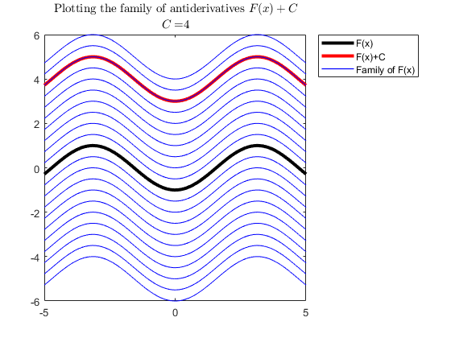    | [Visualizando Antiderivadas](https://matlab.mathworks.com/open/github/v1?repo=MathWorks-Teaching-Resources/Calculus-Integrals&project=Integrals.prj&file=Scripts/AntiderivativesViz.mlx)   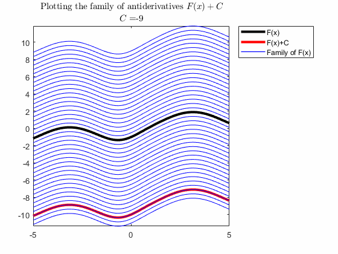    | $\bullet$ ver una presentación gráfica del concepto de antiderivadas generales.   $\bullet$ desarrollar fluidez computacional con las antiderivadas de potencias,   senos, cosenos y exponenciales.    | [Calcular Antiderivadas](https://matlab.mathworks.com/open/github/v1?repo=MathWorks-Teaching-Resources/Calculus-Integrals&project=Integrals.prj&file=Scripts/AntiderivativesPractice.mlx)   $\displaystyle {\int \sin (3z)\;dz=-\frac{\cos (3z)}{3}+C}$     |
| [FundamentalTheorem.mlx](https://matlab.mathworks.com/open/github/v1?repo=MathWorks-Teaching-Resources/Calculus-Integrals&project=Integrals.prj&file=Scripts/FundamentalTheorem.mlx)   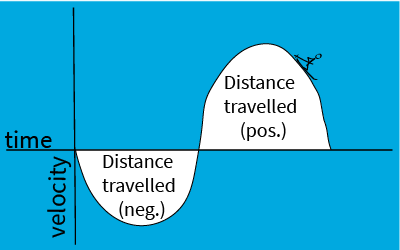    | [Visualizando el Teorema Fundamental del Cálculo](https://matlab.mathworks.com/open/github/v1?repo=MathWorks-Teaching-Resources/Calculus-Integrals&project=Integrals.prj&file=Scripts/FundamentalTheoremViz.mlx)   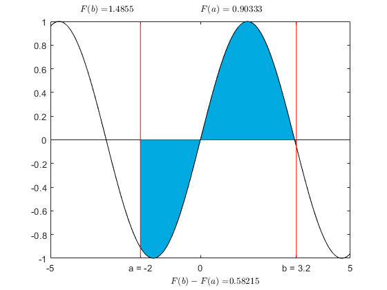    |    $\bullet$ explicar el teorema fundamental del cálculo.   $\bullet$ entender por qué el Teorema Fundamental del Cálculo tiene sentido gráficamente.   $\bullet$ desarrollar fluidez computacional para integrales definidas que involucran combinaciones lineales y  racionales de potencias, senos, cosenos, exponenciales y logaritmos naturales.    | [Aplicar el Teorema Fundamental del Cálculo](https://matlab.mathworks.com/open/github/v1?repo=MathWorks-Teaching-Resources/Calculus-Integrals&project=Integrals.prj&file=Scripts/FundamentalTheoremPractice.mlx)   $\displaystyle {\int_1^3 \frac{1}{w^2 }\;dw=-\frac{1}{3}+1=\frac{2}{3}}$     | 
| [Riemann.mlx](https://matlab.mathworks.com/open/github/v1?repo=MathWorks-Teaching-Resources/Calculus-Integrals&project=Integrals.prj&file=Scripts/Riemann.mlx)   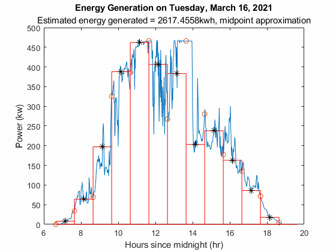    | [Visualizando Sumas de Riemann](https://matlab.mathworks.com/open/github/v1?repo=MathWorks-Teaching-Resources/Calculus-Integrals&project=Integrals.prj&file=Scripts/RiemannViz.mlx)   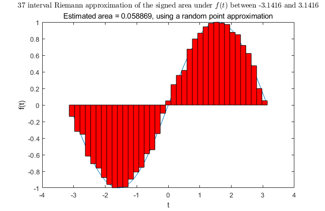    | $\bullet$ explicar y aplicar las diferentes aproximaciones calculadas por un  método de punto final izquierdo, punto final derecho, punto medio, máximo o mínimo  para seleccionar un valor de altura en una suma de Riemann.    | $\bullet$ explicar y aplicar la aproximación trapecial.   $\bullet$ explicar por qué aumentar el número de intervalos en una aproximación disminuirá el error.   $\bullet$ discutir las implicaciones de aplicar el cálculo en aplicaciones con valores que son discretos o continuos.     |
| [Substitution.mlx](https://matlab.mathworks.com/open/github/v1?repo=MathWorks-Teaching-Resources/Calculus-Integrals&project=Integrals.prj&file=Scripts/Substitution.mlx)   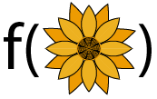    | [Visualizando Sustitución](https://matlab.mathworks.com/open/github/v1?repo=MathWorks-Teaching-Resources/Calculus-Integrals&project=Integrals.prj&file=Scripts/SubstitutionViz.mlx)   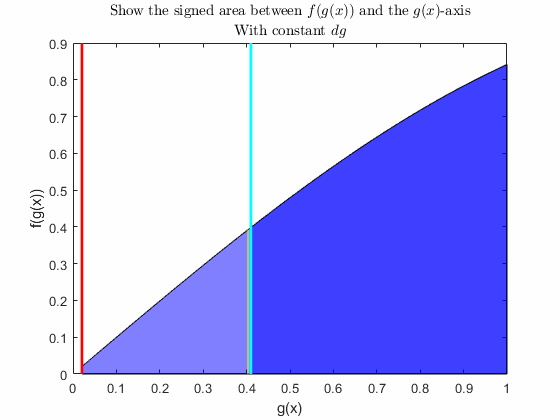    | $\bullet$ explicar qué es el método de sustitución y cómo funciona.   $\bullet$ desarrollar fluidez con el cálculo de integrales de combinaciones de  potencias, senos, cosenos, exponenciales y logaritmos que son solubles  por sustitución a mano.   $\bullet$ ver una comprensión gráfica del método de sustitución.    | [Aplicar el método de sustitución](https://matlab.mathworks.com/open/github/v1?repo=MathWorks-Teaching-Resources/Calculus-Integrals&project=Integrals.prj&file=Scripts/SubstitutionPractice.mlx)   $\displaystyle {\int \frac{\cos \left(\ln (t)+1\right)}{t}\;dt=\sin \left(\ln (t)+1\right)+C}$     |
| [ByParts.mlx](https://matlab.mathworks.com/open/github/v1?repo=MathWorks-Teaching-Resources/Calculus-Integrals&project=Integrals.prj&file=Scripts/ByParts.mlx)   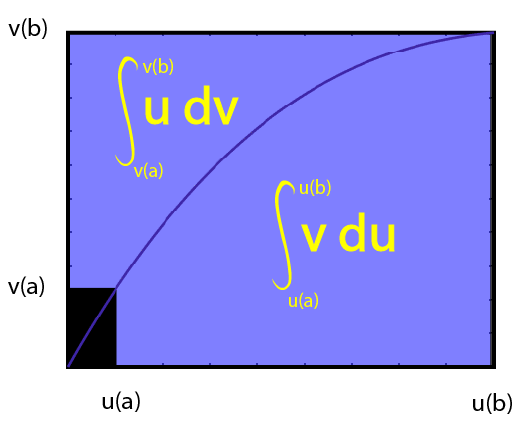    | [Visualizando la Integración por Partes](.Scripts/ByPartsViz.mlx)       |  $\bullet$ explicar qué es el método de integración por partes y cómo funciona.   $\bullet$ desarrollar fluidez con el cálculo de integrales que involucran potencias, senos,  cosenos, exponenciales y logaritmos que son solubles por integración por  partes a mano.   $\bullet$ ver una comprensión gráfica de la fórmula de integración por partes.    | [Aplicar el método de integración por partes](https://matlab.mathworks.com/open/github/v1?repo=MathWorks-Teaching-Resources/Calculus-Integrals&project=Integrals.prj&file=Scripts/ByPartsPractice.mlx)   $\displaystyle {\int y^2 e^y \;dy=y^2 e^y -2ye^y +2e^y +C}$   &nbsp;&nbsp;&nbsp;&nbsp;&nbsp;&nbsp;&nbsp;&nbsp;&nbsp;&nbsp;&nbsp;&nbsp;&nbsp;&nbsp;&nbsp;&nbsp;&nbsp;&nbsp;&nbsp; $\displaystyle =(y^2 -2y+2)e^y +C$     |

# [Aplicación de Tarjetas Didácticas de Cálculo](https://matlab.mathworks.com/open/github/v1?repo=MathWorks-Teaching-Resources/Calculus-Integrals&project=Integrals.prj&file=Apps/CalculusFlashcards.mlapp")
| 1. Elige el tipo de práctica.    | 2. Resuelve problemas.    | 3. Analiza tu progreso.     |
| :-- | :-- | :-- |
| 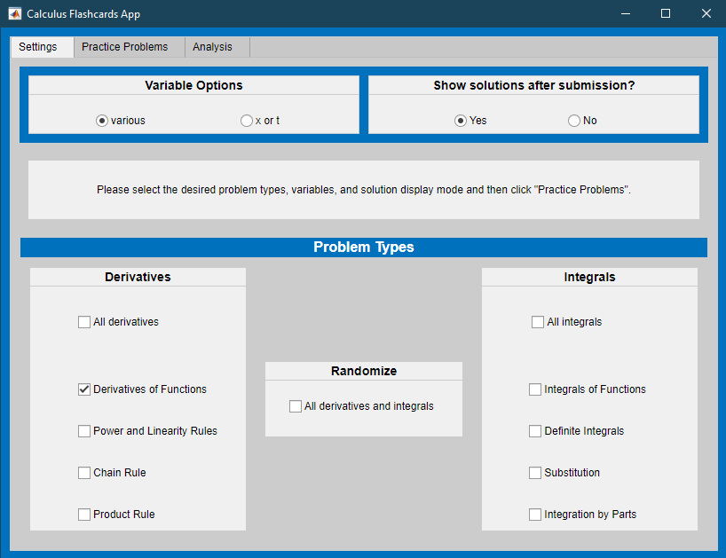  | 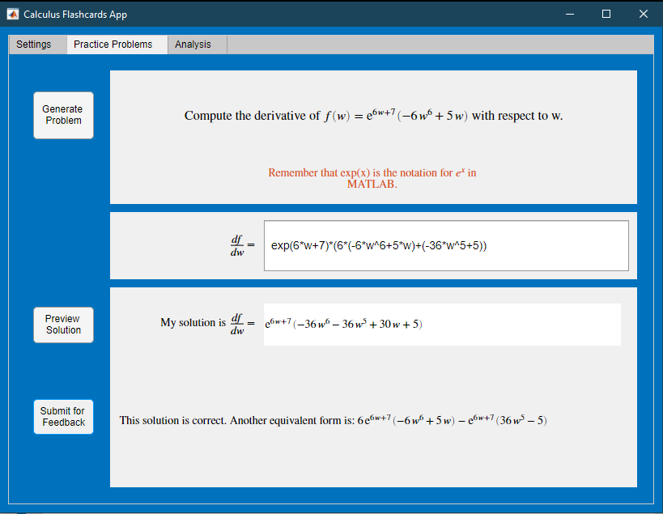 | 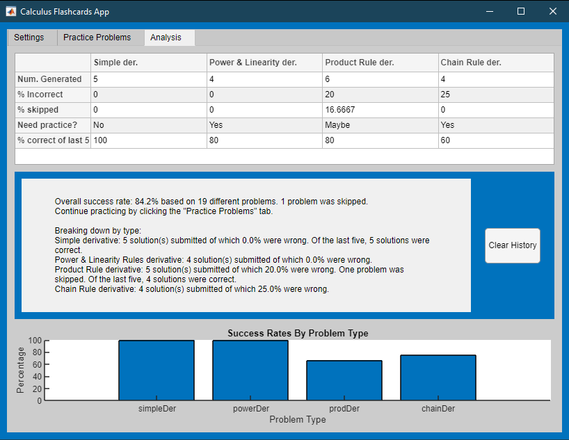  |

# Configuración para Usar la Aplicación de Tarjetas Didácticas de Cálculo

MATLAB Desktop

1.  Asegúrate de tener MATLAB R2021a o una versión más reciente instalada.
2. Descarga <samp>CalculusFlashcards.mlapp</samp> o descarga y descomprime el repositorio completo.
3. Haz clic derecho en la aplicación dentro de MATLAB y selecciona ejecutar o escribe <samp>run("CalculusFlashcards.mlapp")</samp> en la Ventana de Comandos.

MATLAB Online

1.  

# Licencia

La licencia para este módulo está disponible en [LICENSE.md](https://github.com/MathWorks-Teaching-Resources/Calculus-Integrals/blob/release/LICENSE.md).

# Módulos de Material Didáctico Relacionados
| **Módulo de Material Didáctico**    | **Contenido de Muestra**    | **Disponible en:**     |
| :-- | :-- | :-- |
| [**Cálculo: Derivadas**](https://www.mathworks.com/matlabcentral/fileexchange/99249-calculus-derivatives)     |     |       [GitHub](https://github.com/MathWorks-Teaching-Resources/Calculus-Derivatives)      |
|  [**Métodos Numéricos con Aplicaciones**](https://www.mathworks.com/matlabcentral/fileexchange/111490-numerical-methods-with-applications)    |     |       [GitHub](https://github.com/MathWorks-Teaching-Resources/Calculus-Derivatives)      |

O siéntase libre de explorar nuestro otro [contenido de material didáctico modular](https://www.mathworks.com/matlabcentral/fileexchange/?q=tag%3A%22courseware+module%22&sort=downloads_desc_30d).

# Recursos para Educadores
-  [Página para Educadores](https://www.mathworks.com/academia/educators.html) 

# Contribuir

¿Buscas más? ¿Encontraste un problema? ¿Tienes una sugerencia? Por favor, contacta al [equipo de recursos didácticos de MathWorks](mailto:%20onlineteaching@mathworks.com). Si quieres contribuir directamente a este proyecto, puedes encontrar información sobre cómo hacerlo en la página de [CONTRIBUTING.md](https://github.com/MathWorks-Teaching-Resources/Calculus-Integrals/blob/release/CONTRIBUTING.md) en GitHub.

 *©* Derechos de autor 2023 The MathWorks™, Inc